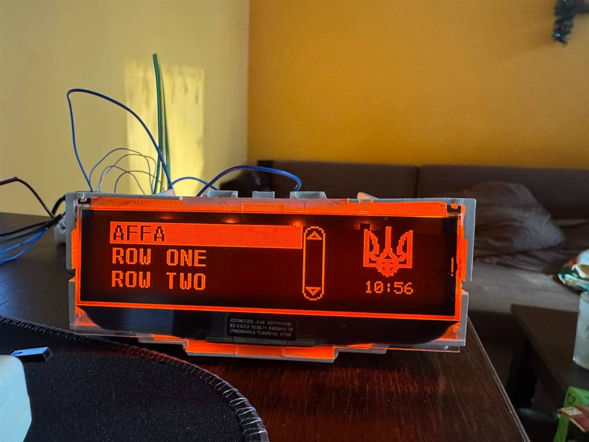

# AffaDisplay



A non-blocking ESP32 driver for Renault **AFFA2 / AFFA3** OEM dash panels over CAN.
MIT · Arduino + PlatformIO · C++17 · no heap after `begin()` · no `delay()` anywhere.

Everything in that photo is one panel, one bus, at once: the two-row menu screen with its
header and scrollbar, a 48 × 48 bitmap in the right pane, and the panel's own clock.

**[Українською](#українською)**

---

## What it is, and what it is not

**It is a transport.** It speaks the panel's protocol: the opening handshake, ISO-TP
segmentation, registration, the heartbeat, key decode and acknowledgement, and the frame
builders for every screen the panel has.

**It is not a UI.** Which item is selected, what a long press means, how fast a title
scrolls, when to repaint — those are decisions about *your* product. A menu widget, a
marquee and a key gesture used to live in here; all three were deleted in 2.0. The render
calls are unconditional, keys come out of `onKey()`, and what happens next is yours.

- **Nothing blocks.** No `delay()`, no busy-wait, no send that waits for an ACK. `IClock`
  exposes `millis()` and deliberately nothing else.
- **Renders are callable from any task** — all of them, including ones written after this
  sentence, because the cross-task boundary sits inside `enqueue()`, below every builder.
- **Every render returns `Submitted`** — a ticket and a `Result`, `[[nodiscard]]`, so a
  screen that silently never appeared is a compiler warning rather than a mystery.
- **An unsupported call returns `NotSupported`**, never a silent success.
- **The host tests need no hardware.** 31 cases, `platform = native`, ~2 s.

## Quick start

```cpp
#include <AffaDisplay.h>

struct ArduinoClock final : affa::IClock {
  uint32_t millis() const override { return ::millis(); }
};

affa::CanCommonLink   g_link;
ArduinoClock          g_clock;
affa::CarminatDisplay g_display(g_link, g_clock);
affa::rtos::AffaTask  g_task;

void setup() {
  g_display.onKey([](affa::Key k, affa::KeyEdge e, void*) {
    if (k == affa::Key::Pause && e == affa::KeyEdge::Click) g_display.setText("PAUSED");
  }, nullptr);

  g_link.begin(GPIO_NUM_5, GPIO_NUM_4, 500000);   // rx, tx — RX FIRST, it is the usual trap
  g_display.begin();
  g_task.start(g_display);                        // and never call poll() again
}

void loop() {
  g_display.setText("HELLO");                     // from here, an HTTP handler, anywhere
  delay(1000);
}
```

```ini
lib_deps =
  collin80/can_common@0.4.0
  https://github.com/collin80/esp32_can.git#c329e6be6931e86f82e38e0f982c9ed951c45cca
build_flags =
  -std=gnu++17
  -D AFFA_PANEL_CARMINAT=1
  -D AFFA_ENABLE_CANCOMMON_LINK=1
build_unflags = -std=gnu++11
```

**Naming no panel is a compile error, not a default** — a misspelled
`-D AFFA_PANEL_CARMINET=1` is caught by an `#error`, because `-Wundef` cannot see it.

**The panel opens the conversation.** A silent bus is normal until it speaks: we announce a
bare `BA` every ~30 s and wait for `0x3CF: 61 11 xx`.

## Panel families

| Family | Class | Sync | Data | Keys |
| --- | --- | --- | --- | --- |
| **Carminat / AFFA3** | `affa::CarminatDisplay` | `0x3AF` → `0x3CF` | `0x151`, `0x1F1` | `0x1C1` → `0x5C1` |
| **UpdateList / AFFA2** | `affa::UpdateListDisplay` | `0x3DF` → `0x3CF` | `0x121`, `0x1B1` | `0x0A9` → `0x4A9` |
| **Instrument cluster** | `affa::ClusterDisplay` | `0x3AF` → `0x3CF` | `0x151`, `0x1F1` | — |

One encoding serves **every glass** in the UpdateList family: the segment display renders 8
cells of the field and a wider one renders all 12, and the radio never learns which answered.
There is no LCD variant, because there never was one.

The ACK id is **computed** as `funcId | 0x400`, never tabulated. `0x0A9 | 0x400` is `0x4A9`
and not `0x5A9`, because bit 8 is already clear in `0x0A9` — uniquely in either table.

## What it can render

Ask before you call: `supports(Feature::X)` for capability, `panelGeometry()` for size —
and **every geometry field is zero unless that surface exists**.

| | Carminat | UpdateList | Cluster |
| --- | :---: | :---: | :---: |
| `setText` | 8 chars | 8 chars¹ | — ² |
| `setTime` | ✔ | — | — |
| `setPower` | ✔ | ✔ | ✔ |
| `showMenu` / `highlightItem` — 2 × 26 | ✔ | — | — |
| `showMenuN` / `selectMenuItem` — up to 10 items, with pictogram and scrollbar | ✔ | — | — |
| `showInfoMenu` / `showInfoPopup` — 3 × 8 | ✔ | — | — |
| `showPopupText` / `hidePopup` — a true overlay | ✔ | — | — |
| `showFullscreenText`, `showConfirmBox` / `selectBoxButton` | ✔ | — | — |
| `showNavBitmap` — 48 × 48 mono | ✔ | — | — |
| keys in, acknowledged on the wire | ✔ | ✔ | — |

¹ a promise, not a measurement: the frame always carries 12 cells, so a wider glass shows
more for free.  ² the one cluster capture contains no text frame, so the encoding is unknown.

## What is proven on glass, and what is not

The distinction this project cares about most. Full record with evidence in
[`docs/BENCH-VERIFIED.md`](docs/BENCH-VERIFIED.md).

**Seen on a real Carminat** — handshake and registration (ACK mean 1 287 µs), `setText`,
`setTime`, `setPower`, the two-row menu with selection, `showMenuN` **with a pictogram and a
positioned scrollbar**, popup show/hide, fullscreen animating at ~190 ms per screen, the
48 × 48 nav bitmap, a counter at 2 Hz, and an **8.3-hour soak: 257 k frames, zero ring
overflows, zero controller errors, flat heap**.

**Seen on a real UpdateList panel** — handshake, `setPower`, normal mode, menu mode with
three rows and a scrollbar, selected-row inversion, scrolling text.

**Built and host-tested, never confirmed on glass** — Carminat's info popup and confirm box;
UpdateList's icon bytes, and any menu row wider than 12 cells.

**Known not to work** — `3EF A6 hh mm` does not set the clock on an UpdateList panel: the bus
accepts the frame and the clock does not move. UpdateList fullscreen concatenates into one
~19-character line rather than stacking rows.

**Never run at all** — the whole cluster family. It is transcribed from **one** capture, it
is never enabled by default, and **its opening cannot complete**: there is no `61 11` in that
capture, so the hello is never triggered. Whether the trigger is the panel's `69` or our own
request is not decidable from one sample — [`docs/NOTES.md`](docs/NOTES.md) §1.1.

## Threading

Two modes, chosen at compile time.

| | `AFFA_ENABLE_TASK=0` | `AFFA_ENABLE_TASK=1` (default on ESP32) |
| --- | --- | --- |
| who calls `poll()` | you, from exactly one task, for ever | the library, on a task it owns |
| who may render | that same task only | **any task, calling the panel directly** |
| what breaks it | anything blocking that task | a callback that blocks, and nothing else |

The default flipped in 2.0. It used to be `0`, and thirteen of nineteen shipped examples
turned it off and pumped `poll()` from `loop()` — including the one whose HTTP handlers then
raced the queue. Key latency is bounded by the task period (2 ms) and nothing else: `onKey()`
still fires synchronously inside `poll()`, never through a queue.

## Configuration

[`src/AffaConfig.h`](src/AffaConfig.h) is the single knob header — every gate documented with
what it costs and what breaks, **including the ones that were deleted and why**. Set them in
your own `build_flags`; the header only supplies defaults.

An unselected panel costs **zero** flash, and that is a mechanism rather than a hope: each
optional `.cpp` gates its whole body and compiles to an empty object file.

## Examples

`03_hello` — sixty lines, the smallest correct program · **`17_mediascreen`** — the console:
every render, a live frame ring, key capture, the byte-level override, and a **self-check**
that proves the link one step at a time and names the step that failed · `18_aiscreen` — a
content feed from anything that can compose a document.

**Flash `17_mediascreen` first on new hardware** and press RUN SELF-CHECK.

## Documents

| | |
| --- | --- |
| [`docs/WIRE.md`](docs/WIRE.md) | **Generated** from the golden vectors CI asserts. 103 frames, every one checked byte for byte. Prose about a bus drifts from the bus; an assertion cannot. |
| [`docs/API.md`](docs/API.md) | The contracts: threading, `Result`, latency, capabilities. It does **not** copy declarations — the headers are the declarations. |
| [`docs/NOTES.md`](docs/NOTES.md) | What we do **not** know, how this project has got things wrong eight times running, and the incidents behind the threading model. |
| [`docs/BENCH-VERIFIED.md`](docs/BENCH-VERIFIED.md) | What a human looked at on real glass. |

```
pio test -e native      # 31 cases, no hardware
pio run                 # 5 environments
```

Licence: **MIT**, see [`LICENSE`](LICENSE).

---

## Українською

Неблокуючий драйвер штатних панелей Renault **AFFA2 / AFFA3** на ESP32 через CAN.
MIT · Arduino + PlatformIO · C++17 · без купи після `begin()` · без `delay()` ніде.

Усе на фото — одна панель, одна шина, одночасно: дворядковий екран меню із заголовком і
смугою прокрутки, картинка 48 × 48 у правій панелі, і власний годинник панелі.

### Що це і чим воно не є

**Це транспорт.** Він говорить протоколом панелі: відкриття, сегментація ISO-TP, реєстрація,
серцебиття, декодування і підтвердження клавіш, і збирачі кадрів для кожного екрана.

**Це не UI.** Який пункт вибрано, що означає довге натискання, як швидко їде назва, коли
перемальовувати — це рішення про *ваш* продукт. Віджет меню, marquee і жест клавіші тут
колись жили; усі три видалено у 2.0. Виклики малювання безумовні, клавіші виходять через
`onKey()`, а що робити далі — ваше.

- **Ніщо не блокує.** Ні `delay()`, ні активного очікування, ні передачі, що чекає на ACK.
- **Рендери можна кликати з будь-якої задачі** — усі, бо міжзадачна межа сидить усередині
  `enqueue()`, нижче за кожен збирач.
- **Кожен рендер повертає `Submitted`** — квиток і `Result`, `[[nodiscard]]`.
- **Непідтриманий виклик повертає `NotSupported`**, а не мовчазний успіх.
- **Тестам не потрібне залізо.** 31 випадок, `platform = native`, ~2 с.

Швидкий старт — код в англійській половині вище, він однаковий.

### Родини панелей

| Родина | Клас | Sync | Дані | Клавіші |
| --- | --- | --- | --- | --- |
| **Carminat / AFFA3** | `affa::CarminatDisplay` | `0x3AF` → `0x3CF` | `0x151`, `0x1F1` | `0x1C1` → `0x5C1` |
| **UpdateList / AFFA2** | `affa::UpdateListDisplay` | `0x3DF` → `0x3CF` | `0x121`, `0x1B1` | `0x0A9` → `0x4A9` |
| **Приборка** | `affa::ClusterDisplay` | `0x3AF` → `0x3CF` | `0x151`, `0x1F1` | — |

Одне кодування обслуговує **будь-яке скло** в родині UpdateList: сегментний дисплей показує
8 комірок поля, ширший — усі 12, і радіо ніколи не дізнається, яке з них відповіло. Ніякого
LCD-різновиду немає, бо його ніколи й не було.

### Що вміє малювати

Питайте перед викликом: `supports(Feature::X)` про можливість, `panelGeometry()` про розмір —
і **кожне поле геометрії нульове, якщо такої поверхні немає**.

| | Carminat | UpdateList | Приборка |
| --- | :---: | :---: | :---: |
| `setText` | 8 симв. | 8 симв.¹ | — ² |
| `setTime` | ✔ | — | — |
| `setPower` | ✔ | ✔ | ✔ |
| `showMenu` / `highlightItem` — 2 × 26 | ✔ | — | — |
| `showMenuN` / `selectMenuItem` — до 10 пунктів, з піктограмою і смугою | ✔ | — | — |
| `showInfoMenu` / `showInfoPopup` — 3 × 8 | ✔ | — | — |
| `showPopupText` / `hidePopup` — справжній оверлей | ✔ | — | — |
| `showFullscreenText`, `showConfirmBox` / `selectBoxButton` | ✔ | — | — |
| `showNavBitmap` — 48 × 48 моно | ✔ | — | — |
| клавіші з підтвердженням на шині | ✔ | ✔ | — |

¹ обіцянка, а не вимір: кадр завжди несе 12 комірок.  ² у єдиному лозі приборки немає
жодного текстового кадру, тож кодування невідоме.

### Що доведено на склі, а що ні

Найважливіша різниця в цьому проєкті. Повний запис із доказами —
[`docs/BENCH-VERIFIED.md`](docs/BENCH-VERIFIED.md).

**Бачено на справжньому Carminat** — відкриття і реєстрація (середній ACK 1 287 мкс),
`setText`, `setTime`, `setPower`, дворядкове меню з вибором, `showMenuN` **з піктограмою і
позиціонованою смугою прокрутки**, попап, повний екран з анімацією ~190 мс на екран, картинка
48 × 48, лічильник на 2 Гц, і **8,3-годинний прогін: 257 тис. кадрів, нуль переповнень
кільця, нуль помилок контролера, рівна купа**.

**Бачено на справжній панелі UpdateList** — відкриття, `setPower`, звичайний режим, режим
меню з трьома рядками і смугою, інверсія вибраного рядка, біжучий текст.

**Зібрано і протестовано на хості, на склі не підтверджено** — інфо-попап і діалог
підтвердження в Carminat; іконкові байти UpdateList і будь-який рядок меню, ширший за 12.

**Відомо, що не працює** — `3EF A6 hh mm` не ставить годинник на панелі UpdateList: шина кадр
приймає, годинник не рухається. Повний екран UpdateList зливається в один рядок ~19 символів
замість кількох рядків.

**Не запускалося взагалі** — уся родина приборки. Вона перенесена з **одного** лога, ніколи
не вмикається типово, і **її відкриття не може завершитися**: у тому лозі немає `61 11`, тож
hello не спрацьовує. Чи тригер це `69` панелі, чи наш власний запит — з одного зразка не
вирішується: [`docs/NOTES.md`](docs/NOTES.md) §1.1.

### Багатозадачність

| | `AFFA_ENABLE_TASK=0` | `AFFA_ENABLE_TASK=1` (типово на ESP32) |
| --- | --- | --- |
| хто кличе `poll()` | ви, з рівно однієї задачі, назавжди | бібліотека, на власній задачі |
| хто може рендерити | лише та сама задача | **будь-яка, кличучи панель напряму** |
| що це ламає | будь-що блокуюче на тій задачі | колбек, що блокує, і більше нічого |

Типове значення перевернулося у 2.0. Раніше було `0`, і тринадцять із дев'ятнадцяти
прикладів це вимикали й крутили `poll()` з `loop()` — включно з тим, чиї HTTP-обробники потім
змагалися з чергою. Затримка клавіші обмежена періодом задачі (2 мс) і нічим більше.

### Конфігурація і документи

[`src/AffaConfig.h`](src/AffaConfig.h) — єдиний файл перемикачів, кожен із поясненням, чого
він коштує і що ламає, **включно з тими, які видалено, і чому**. Невибрана панель коштує
**нуль** флешу, і це механізм, а не сподівання.

Документи — у таблиці англійської половини: `docs/WIRE.md` (згенеровано з тестів),
`docs/API.md` (контракти), `docs/NOTES.md` (чого не знаємо), `docs/BENCH-VERIFIED.md` (що
бачили на склі).

Ліцензія: **MIT**, див. [`LICENSE`](LICENSE).

---

## 🇺🇦 Ukraine

This library is developed in Ukraine. If it saved you time, consider donating to
[Come Back Alive](https://savelife.in.ua/en/) or [UNITED24](https://u24.gov.ua/).

## 🇺🇦 Україна

Ця бібліотека створюється в Україні. Якщо вона зекономила вам час — задонатьте
[Повернись живим](https://savelife.in.ua/) або [UNITED24](https://u24.gov.ua/).
